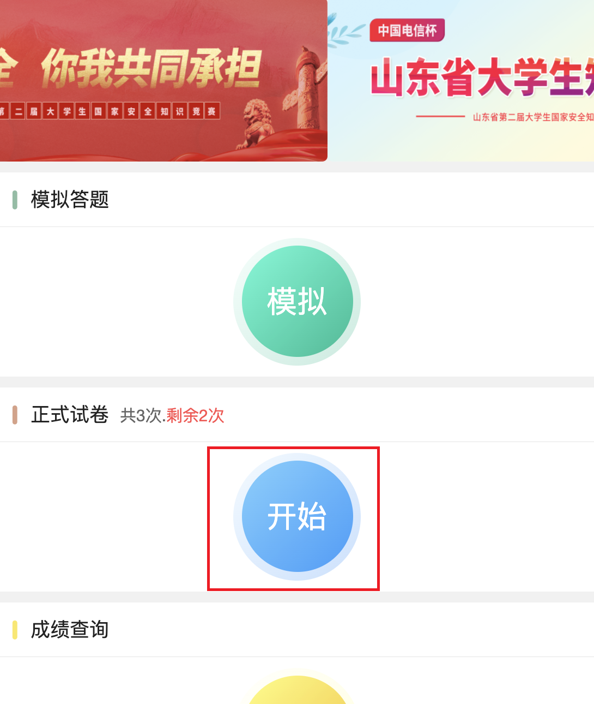
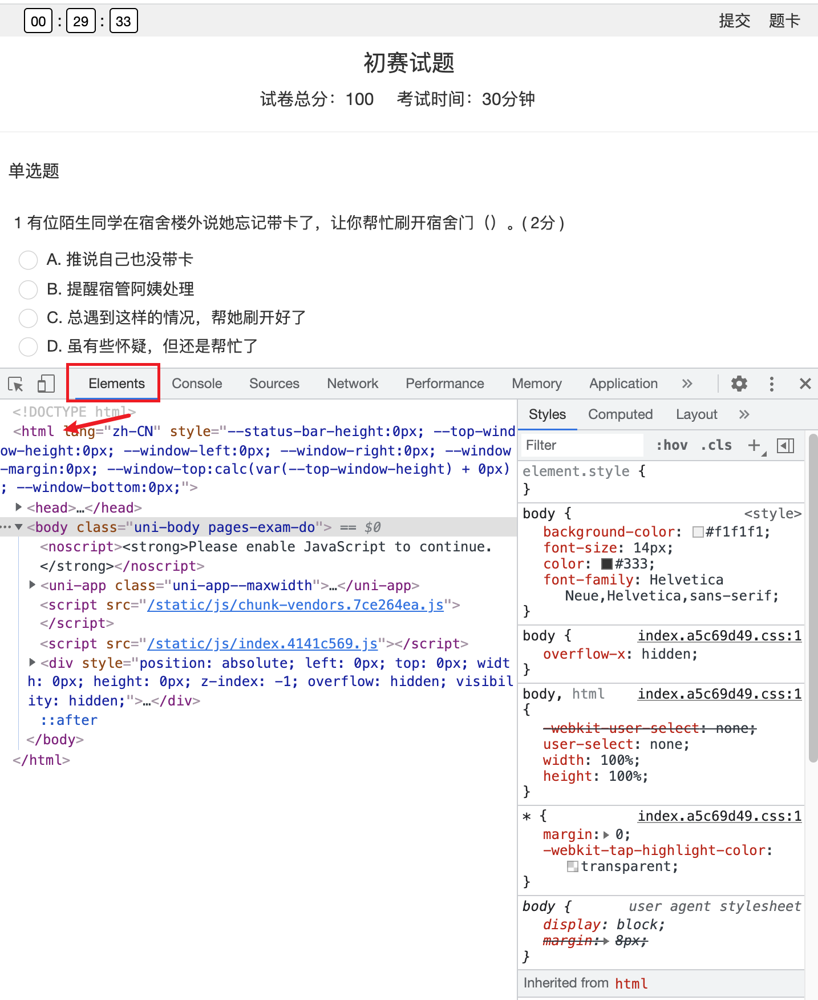
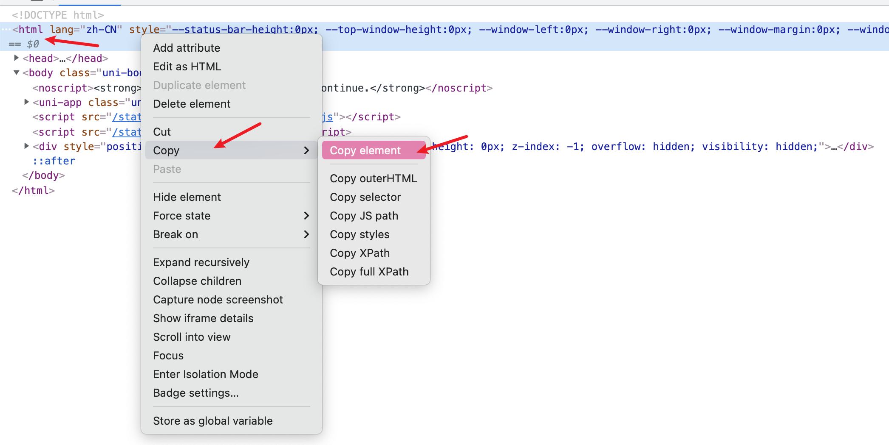
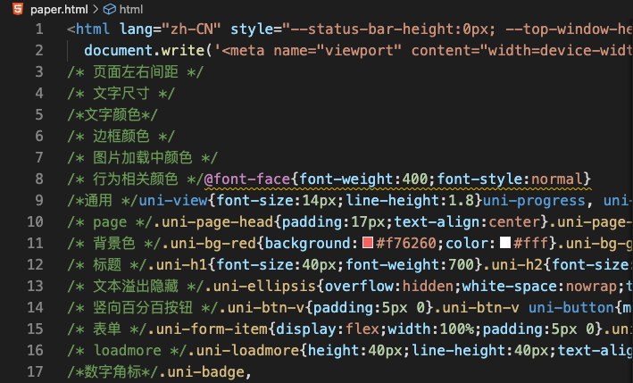
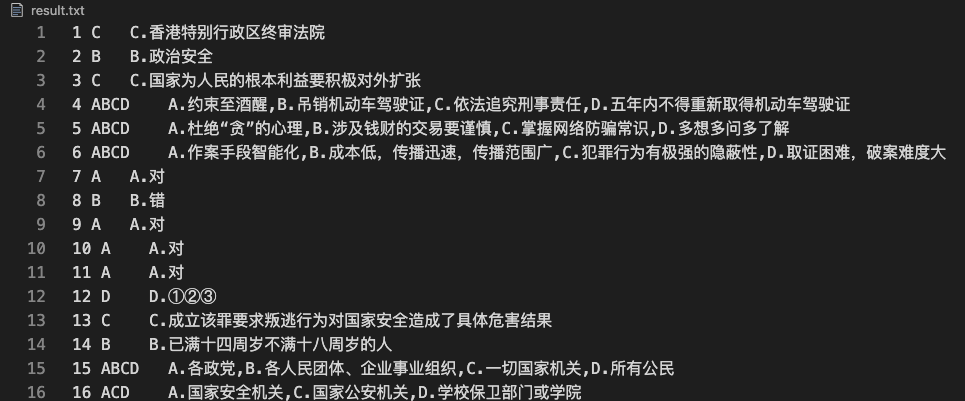

使用说明

## 1 环境安装

在控制台中依次执行以下脚本

```
# 创建虚拟环境
python3 -m venv venv

# 加载虚拟环境
.\venv\Scripts\activate

# 安装第三方模块（一行一行执行）
pip install -i https://pypi.tuna.tsinghua.edu.cn/simple pandas
pip install -i https://pypi.tuna.tsinghua.edu.cn/simple beautifulsoup4
pip install -i https://pypi.tuna.tsinghua.edu.cn/simple thefuzz
pip install -i https://pypi.tuna.tsinghua.edu.cn/simple python-Levenshtein
pip install -i https://pypi.tuna.tsinghua.edu.cn/simple openpyxl
pip install -i https://pypi.tuna.tsinghua.edu.cn/simple pyppeteer
```
## 2. 自动答题

1. 打开 auto.py,修改 
   
   * `opt.username`：身份证
   * `opt.password`：密码
   * `opt.school` ：学校名

2. 执行`python auto.py`


## 3. 手动答题

### 1 获取试题

1. 在浏览器（chrome）中登录系统
   http://exam.sdschoolsafe.cn:7007/#/

2. 点击开始进行答卷



3. 获取试题

   3.1 按 F12 打开控制台，选择 Elements 选项卡

   

   3.2 在 html 标签处右键，选择 Copy -> Copy element

   

4 打开目录下的 paper.html, 用 3.3 中复制的内容替换文件中的原有内容



### 2 计算答案

控制台中执行如下命令

```
python main.py
```

执行结束后当前目录下会生成 `result.txt`,其中包括了当前题目的所有答案


